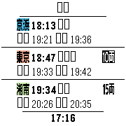

# KHUTSS
とりあえずテスト用ファイルを置きます。
### データ
"- 12:00,行先,路線ID,上段備考,下段備考"で記述します。
#### 路線ID
- 1:京浜東北線
- 2:上野東京ライン
- 3:湘南新宿ライン
- 4:埼京線
#### 上段備考
- a:15両
- b:10両
- c:快速(京浜東北線・埼京線向け）
- d:通勤快速(埼京線向け)
- e:特別快速(おまけ)
https://gist.githubusercontent.com/tc5206/8a9270333c0a595191ec5a82daaf0383/raw/cd11bc3e0f89ebf6a4b02153f65d651e34f5e5a7/KHUTSS_test.md

  

